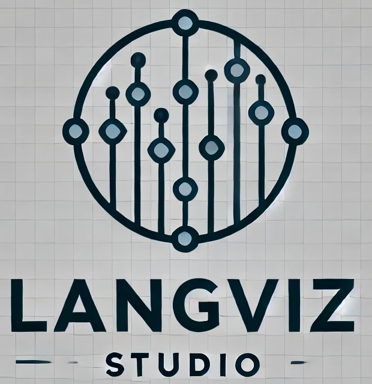

# LangViz-studio



LangViz-Studio is an observability toolkit for [LangGraph](https://pypi.org/project/langgraph/) workflows.

It enables you to track the execution states, node transitions, and conditional edges of your state-based flows or agent pipelines in real-time, sending all data asynchronously to a customizable endpoint (e.g., a Next.js server) for visualization.

## Overview
LangViz-Studio (Python side) collects runtime states (node start/end, edges, conditional branches, etc.) in an ObservabilityStateGraph and sends JSON logs to Next.js endpoints. These logs are then stored or displayed so you can track the flow’s execution in real time.

Common use cases include:

Visualizing which node your agent or state-machine is on
Inspecting how many times each edge is used
Monitoring large workflows in real-time

## Key Features

- GraphObservability
    - Automatically records and sends node start/end events, edge transitions, and conditional branch usage.
    - Maintains a unique graphId (UUID by default) and an optional friendly graph_name.
    - Sends data to a configured endpoint (http://localhost:3000 by default).

- ObservabilityStateGraph
    - A subclass of langgraph.graph.StateGraph that automatically wraps node functions and edge definitions so all observability data is captured with no extra code.
    - Just use add_node(...), add_edge(...), add_conditional_edges(...) as normal, and your graph’s runtime states will be sent in real-time for visualization.

- Asynchronous and Non-blocking
    - Uses an internal background thread running an asyncio event loop to POST updates via httpx.AsyncClient, ensuring minimal impact on your main workflow thread.

## Quick Start

```bash
# 1) Spin up the local MySQL DB:
docker-compose up -d

# 2) Install packages:
npm install

# 3) Run Prisma migrations:
npx prisma migrate dev

# 4) Start the Next.js server:
npm run dev
```

## DEMO

<video controls width="250">
  <source src="https://github.com/user-attachments/assets/f736cadc-f7db-4bdf-8746-ccb25e672f6e" type="video/mov" />
</video>

## License
MIT License. See [LICENSE](./LICENSE) for details.

## Contributing
We welcome PRs and issues! Feel free to open an Issue or Pull Request if you want to fix a bug, suggest a feature, or improve documentation.

Enjoy tracking your flows in real time with LangViz-Studio!
